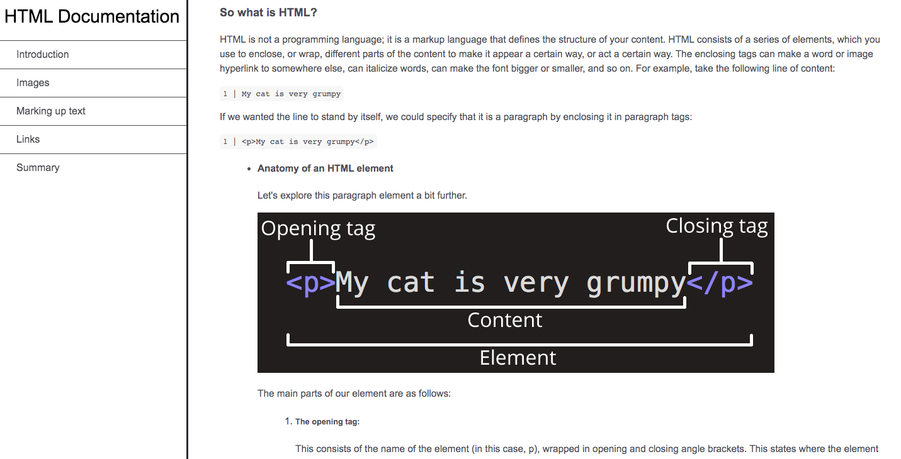

# HTML Documentation

## General Information:
This project was complete in order to practice basic html and css.Please see MDN's web docs for more information [here](https://developer.mozilla.org/en-US/docs/Learn/Getting_started_with_the_web/HTML_basics)
## Screenshot:

## Technologies:
- HTML
- CSS

## Setup: 
The live version of this webpage can be seen [here](https://tpsst5.github.io/html_documentation_clone/).

## Status:
This project is complete.
